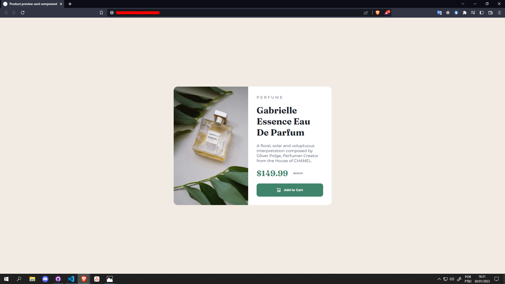
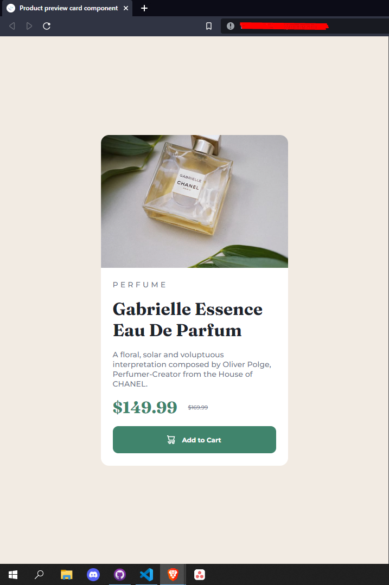

# Frontend Mentor - Product preview card component solution

This is a solution to the [Product preview card component challenge on Frontend Mentor](https://www.frontendmentor.io/challenges/product-preview-card-component-GO7UmttRfa). Frontend Mentor challenges help you improve your coding skills by building realistic projects.

## Table of contents

- [Overview](#overview)
  - [The challenge](#the-challenge)
  - [Screenshot](#screenshot)
  - [Links](#links)
- [My process](#my-process)
  - [Built with](#built-with)
  - [What I learned](#what-i-learned)
  - [Continued development](#continued-development)
  - [Useful resources](#useful-resources)
- [Author](#author)
- [Acknowledgments](#acknowledgments)

## Overview

### The challenge

Users should be able to:

- View the optimal layout depending on their device's screen size
- See hover and focus states for interactive elements

### Screenshot




### Links

- Solution URL: [Add solution URL here](https://your-solution-url.com)
- Live Site URL: [Add live site URL here](https://your-live-site-url.com)

## My process

### Built with

- Semantic HTML5 markup
- CSS custom properties
- Flexbox
- CSS Grid
- Mobile-first workflow

### What I learned

I learned how to handle media, and I even know some standards like 768px, which is already used by cell phones. But the coolest part was setting up the picture tag to be able to switch between images.

Thus:

```html
<picture>
  <source
    class="card-img"
    media="(max-width: 768px)"
    srcset="./images/image-product-mobile.jpg"
  />
  <source
    class="card-img"
    media="(min-width: 768px)"
    srcset="./images/image-product-desktop.jpg"
  />
  
</picture>
```

### Continued development

I found it very easy as you can have control of the breakpoints. I already use the UI stuff a lot, to the point of getting used to their way. So I had to learn the basics again. Which was really important to me. I might try one day using the UI stuff to see if it gets easier or not. haha

### Useful resources

- [Example resource 1](https://developer.mozilla.org/pt-BR/docs/Learn/HTML/Multimedia_and_embedding/Responsive_images) - Fundamental to help guide me on how to use these responsive images.
- [Example resource 2](https://mdn.github.io/learning-area/html/multimedia-and-embedding/responsive-images/not-responsive.html) - No doubt this site helped me on how to do this image alternation. There are many ways that I didn't even know existed.

## Author

- Github - [@fty57](https://github.com/fty57)
- Frontend Mentor - [@fty57](https://www.frontendmentor.io/profile/fty57)

## Acknowledgments

There are several ways to do the same thing. I was stuck in one way for a good few minutes, but then I tried another way and it worked right away.
